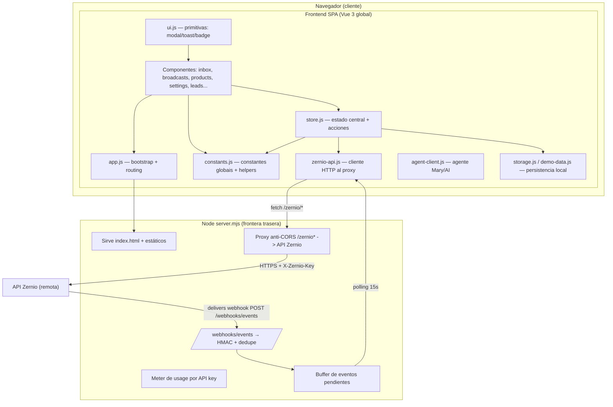
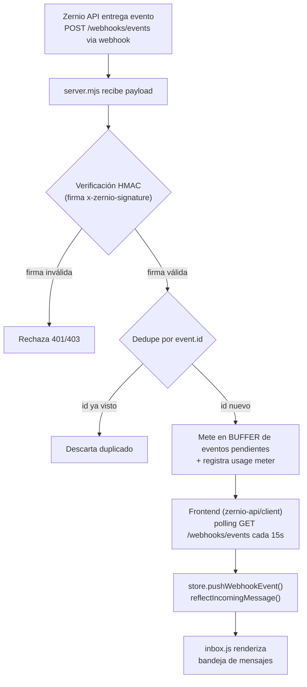

# Auditoría de Arquitectura — Estado ACTUAL

Proyecto: `trebor-zernio-crm-based-prototype`
Fecha de auditoría: 2026-08-16
Modo: READ-ONLY (documentación generada sin modificar `src/` ni `server.mjs`).

Este documento describe la arquitectura **real del sistema actual** a través de tres
diagramas Mermaid. Revela acoplamientos, god-files y cuellos de botella.
Ver resumen de observaciones en [Observaciones estructurales](#observaciones-estructurales).

---

## 1. Arquitectura de alto nivel



**Rutas clave:**
- `index.html` (5.9 KB) — carga Vue global + todos los scripts en orden.
- `server.mjs` (16.4 KB) — estáticos, proxy, webhooks, usage.
- `src/app.js` (13.1 KB) — bootstrap del SPA.

---

## 2. Mapa de dependencias entre módulos frontend

Todos los módulos se registran en el namespace global `window.ZernioCrm` (`Object.assign`),
creando acoplamiento por **namespace global compartido** en vez de inyección de dependencias.

Tamaños anotados en paréntesis (KB). God-files en **rojo**.

```mermaid
flowchart TB
    subgraph CORE["Núcleo global"]
        ZC["window.ZernioCrm (namespace global compartido)"]
        STORE["store.js (17.4 KB) — estado + acciones + webhook nativo"]
        CONST["constants.js (65.4 KB) — GOD-FILE datos+lógica"]
        APP["app.js (13.1 KB)"]
    end

    subgraph SERVICES["Servicios"]
        ZAPI["zernio-api.js (28.5 KB) — cliente API"]
        AGENT["agent-client.js (14.9 KB) — agente Mary"]
    end

    subgraph DATA["Capa de datos"]
        STORAGE["storage.js (3.8 KB) — localStorage namespace"]
        DEMO["demo-data.js (36.2 KB) — datos semilla"]
    end

    subgraph UI["Primitivas UI"]
        UI["ui.js (12.1 KB)"]
    end

    subgraph COMPONENTS["Componentes (todas consumen store+constants via global)"]
        INBOX["inbox.js (124.2 KB) — GOD-FILE"]
        BCAST["broadcasts.js (86.5 KB) — GOD-FILE"]
        SETTINGS["settings.js (61.2 KB) — GOD-FILE"]
        PRODUCTS["products.js (60.5 KB) — GOD-FILE"]
        LEADS["leads.js (48.6 KB)"]
        ONB["onboarding.js (38.6 KB)"]
        LIVE["live-connect.js (35.4 KB)"]
        AGENTS["agents.js (23.5 KB)"]
        OTHER["analytics/billing/channels/dashboard/contacts/system/team (8–19 KB)"]
    end

    ZC --- STORE
    ZC --- CONST
    STORE --- STORAGE
    ZAPI --- ZC
    AGENT --- ZC
    STORE --- ZAPI
    STORE --- DEMO
    STORE --- CONST
    APP --- ZC
    APP --- UI
    INBOX --- STORE
    INBOX --> CONST
    BCAST --> CONST
    SETTINGS --> CONST
    PRODUCTS --> CONST
    LEADS --> CONST
    ONB --> CONST
    UI --- INBOX
    UI --- BCAST
    UI --- PRODUCTS

    INBOX -.acoplamiento alto.-> ZC
    BCAST -.acoplamiento alto.-> ZC
    SETTINGS -.acoplamiento alto.-> ZC
    PRODUCTS -.acoplamiento alto.-> ZC
    CONST -.consumido por TODOS los componentes.-> INBOX
    CONST -.consumido por TODOS los componentes.-> BCAST
    CONST -.consumido por TODOS los componentes.-> SETTINGS
```

**Observación clave:** todos los componentes dependen **transitivamente** de `constants.js`
y del namespace global `ZernioCrm`. No hay ESM/imports — es un barrido de scripts ordenados
por `<script>` en `index.html` que todos pisan el mismo objeto. Un cambio de firma en una
acción de store puede romper cualquier componente sin error en tiempo de build.

---

## 3. Flujo del webhook (entrega → HMAC → dedupe → polling → bandeja)



_Fuentes: server.mjs (proxy, verificación de firma, dedupe por `event.id`, meter de usage),
src/app.js + src/store.js (polling de eventos, `pushWebhookEvent`, `reflectIncomingMessage`),
src/components/inbox.js (representación en la bandeja)._

---

## Observaciones estructurales

### God-files (acoplamiento por tamaño/funciones)
- **`src/components/inbox.js` (124 KB)** — el archivo más grande; mezcla render de bandeja,
  lógica de mensajería, filtros, acciones de store y datos. Es el mayor riesgo de la UI.
- **`src/constants.js` (65 KB)** — **god-file de datos y lógica**: mezcla constantes puras
  (colores, roles, líneas de convenio) con lógica de negocio (`normalizeText`, `matchProducts`,
  `renderWhatsApp`, `buildProductCard`, `escapeHtml`, formato de fechas). Un archivo "constants"
  no debería contener funciones de render/presentación.
- **`src/components/broadcasts.js` (86 KB)** y **`settings.js` (61 KB)** / **`products.js` (60 KB)**:
  componentes grandes que mezclan render + estado + lógica, siguiendo el mismo patrón que inbox.

### Acoplamiento
- **Namespace global compartido (`window.ZernioCrm`)** vía `Object.assign` en cada módulo es el
  patrón de integración. Esto oculta dependencias: los componentes consumen store/constants como
  globales sin declaración, generando acoplamiento invisible y alto riesgo de regresión.
- **`constants.js` es una dependencia transversal** de todos los componentes y servicios; es el
  hub central de acoplamiento. Cualquier cambio ahí impacta a casi toda la app.
- **Reactividad** está centralizada en `store.js`: todos los componentes dependen de sus acciones
  que devuelven proxies reactivos (`Object.assign(window.ZernioCrm, { store,... })`). El re-render
  se orquesta desde store, lo que concentra el acoplamiento en un solo punto.

### Cuellos de botella / flujos
- **Webhook → polling 15s**: no hay push/websocket; la bandeja depende de un polling con
  latencia de hasta 15s. Un evento entrante puede tardar 15s en verse. El buffer en server.mjs es
  el cuello entre la API y la bandeja.
- **Proxy `server.mjs` como único punto de salida a Zernio**: todas las llamadas del frontend
  pasan por él; si cae, toda la capa de servicios deja de funcionar (punto único de fallo, sin
  fallback).
- **`storage.js` + `demo-data.js` en la capa de datos**: persistencia local (localStorage)
  iniciada desde server/store; la semilla demo (36 KB) se carga junto con el estado real,
  lo que acopla datos de ejemplo con datos de producción en el mismo pipeline.

### Riesgo operativo
- Sin módulos/imports reales, no hay árbol de dependencias verificable en build → los diagramas
  reflejan acoplamiento **implícito** que un linter/bundler no detectaría.

---

## Anexo: dimensiones relevadas (KB)

| Archivo | KB |
|---|---|
| src/components/inbox.js | 124.2 |
| src/components/broadcasts.js | 86.5 |
| src/constants.js | 65.4 |
| src/components/settings.js | 61.2 |
| src/components/products.js | 60.5 |
| src/components/leads.js | 48.6 |
| src/components/onboarding.js | 38.6 |
| src/data/demo-data.js | 36.2 |
| src/components/live-connect.js | 35.4 |
| src/services/zernio-api.js | 28.5 |
| src/components/agents.js | 23.5 |
| src/store.js | 17.4 |
| server.mjs | 16.4 |
| src/components/analytics.js | 19.1 |
| src/components/billing.js | 18.8 |
| src/app.js | 13.1 |
| src/components/channels.js | 15.9 |
| src/components/dashboard.js | 15.0 |
| src/services/agent-client.js | 14.9 |
| src/components/contacts.js | 13.7 |
| src/components/system.js | 12.2 |
| src/components/ui.js | 12.1 |
| src/components/team.js | 8.7 |
| src/data/storage.js | 3.8 |
| index.html | 5.9 |